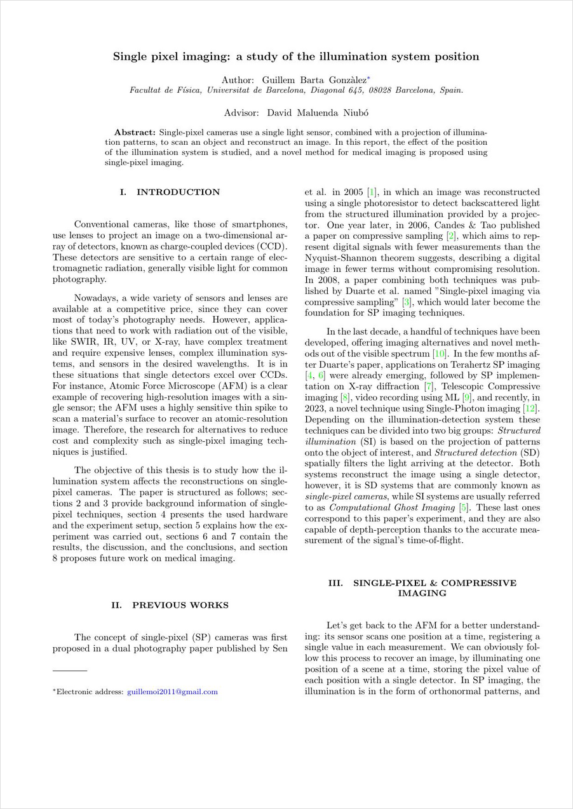

# Single-pixel camera python code

As my Physics final thesis, a single-pixel camera prototype was developed, using an IDS camera and an Icodis projector. The code directory includes all scripts needed to set up and control the camera, and to process and analyze the output data.

## 📄 Bachelor's Thesis

**Single-pixel imaging: a study of the illumination system position**
BSc Physics thesis — Universitat de Barcelona, June 2023
Advisor: David Maluenda Niubó

📖 [Read the full PDF](thesis.pdf)
